# Status – Church Finance (Step 2)

## Architecture Overview

```mermaid
flowchart TD
  subgraph Client["Next.js App Router"]
    LedgerContext["LedgerProvider\n• Server pipeline default\n• Tracks running balances"]
    LedgerUI["/ledger page\n• ReconciliationCard, LedgerTable"]
    ReviewUI["/review page\n• Category workflow"]
  end

  subgraph API["Express (server/index.ts)"]
    UploadRoute["POST /api/upload\n• importService"]
    AccountsRoute["GET /api/accounts\nPOST /accounts/:id/opening-balance"]
    LedgerLockRoute["POST /ledger/:id/(un)lock"]
    ReconciliationRoute["GET /api/reconciliation"]
    LedgerRoute["GET /api/ledger"]
    ReviewRoute["GET /api/review / PATCH category"]
  end

  subgraph Services["Domain services"]
    ImportSvc["services/importService.ts\n• Deterministic hash\n• Ledger lock enforcement"]
    Categorizer["services/categorizationService.ts\n• Minor-unit history"]
    ReconcileSvc["services/reconciliationService.ts\n• Opening + running balance"]
  end

  subgraph Data["Prisma → PostgreSQL"]
    Account[(Account)]
    OpeningBalance[(OpeningBalance)]
    Ledger[(Ledger\n• lock metadata)]
    Transaction[(Transaction\n• amountMinor BIGINT
• hash UNIQUE
• source/rawRow)]
    ImportBatch[(ImportBatch)]
    Category[(Category)]
  end

  Sheets[/Sample XLSX/CSV/] --> UploadRoute
  UploadRoute --> ImportSvc
  ImportSvc --> ReconcileSvc
  ImportSvc --> Data
  AccountsRoute --> Data
  ReconciliationRoute --> ReconcileSvc
  LedgerRoute --> Data
  ReviewRoute --> Data
  Client -->|fetchLedger / fetchReconciliation / saveOpening| API
```

## Data Model Snapshot (Post-Step 2)

| Entity | Key fields | Notes |
| ------ | ---------- | ----- |
| `Ledger` | `id`, `userId`, `month`, `year`, `lockedAt`, `lockedBy`, `lockNote` | Periods can be locked; imports & updates respect `RECONCILIATION_LOCKS_ENABLED`. |
| `OpeningBalance` | `id`, `accountId`, `effectiveDate`, `amountMinor`, `currency`, `note`, `lockedAt`, `lockedBy` | Unique per account/date; mutable until locked. Used to seed running balances & reconciliation. |
| `Transaction` | `amountMinor` (`BIGINT`), `hash` (`UNIQUE`), `sourceFile`, `rawRow`, `accountId`, `importBatchId`, `reference`, `counterparty`, `direction` | Server returns `runningBalanceMinor`; ledger route enforces integer arithmetic. |
| `Account` | `identifier`, `name`, `currency`, `openingBalances[]` | Accounts surfaced via `/api/accounts` for reconciliation UI. |
| `ImportBatch` | `autoCategorizedRows`, counts, timestamps | Unchanged from Step 1. |

## Step 2 Highlights – Opening Balances & Reconciliation

- **Prisma migration** (`20251011194500_reconciliation_opening_balances`)
  - Adds `OpeningBalance` table and ledger lock fields (`lockedAt`, `lockedBy`, `lockNote`).
  - Existing schemas continue to use deterministic transaction hashes; legacy data auto-converted earlier remains compatible.

- **Safe import pipeline**
  - `services/importService.ts` now rejects uploads targeting locked ledger periods (`423 Locked`), ensuring historical months stay immutable once reconciled.
  - Account & ledger provisioning happen inside the transaction; new helper error (`LockedPeriodError`) signals the lock state to the upload route.

- **Running balances everywhere**
  - `/api/ledger` computes per-account running balance in UTC order, honouring OpeningBalance effective dates. Results include `runningBalanceMinor`, consumed by `LedgerTable` (new column) for quick scan of cumulative totals.

- **Opening balance management**
  - `/api/accounts` lists accounts plus most recent opening balance metadata.
  - `/api/accounts/:accountId/opening-balance` upserts balances (blocked if locked). `/api/opening-balances/:id/lock` finalises them.
  - UI card lets operators capture amount/date/note and lock the figure once verified.

- **Reconciliation service & view**
  - `services/reconciliationService.ts` materials running totals for a given account + period, derives bank statement end balance from stored raw rows, flags missing days and duplicate patterns, and reports credit/debit totals.
  - `GET /api/reconciliation` powers the new `ReconciliationCard` on `/ledger`: account + month pickers, opening balance form, lock/unlock buttons, and highlight lists.
  - Status badge surfaces `balanced`, `unreconciled`, or `awaiting statement` with difference in minor units.

- **Locks propagate to editing**
  - `/api/transactions/:id/category` rejects updates for locked ledgers (423), ensuring reconciled periods stay untouched.

- **Client polish**
  - `LedgerTable` renders “Running Balance” column (toggleable) and still honours existing column preferences.
  - `ReconciliationCard` appears when `NEXT_PUBLIC_IMPORT_PIPELINE_MODE=server`; gracefully hides on local/offline mode.
  - `LedgerProvider` context exposes `serverPipelineEnabled` for conditional UI logic.

## Reliability & UX Impact

- ✅ Accounting arithmetic now starts from explicit, lockable opening balances per account/period.
- ✅ Operators can detect gaps (missing statement days) or duplicate patterns before sign-off.
- ✅ Locked periods prevent accidental imports or edits for reconciled months.
- ✅ Ledger view shows cumulative balance per transaction, easing manual cross-checks.
- ⚠️ Statement end balance relies on bank exports that include “Resulting balance”/“Saldo”. Other formats will report status `unknown` (future Step 3 candidate to allow manual entry).
- ⚠️ Duplicate detector is heuristic (normalized description + amount). Consider deeper matching once rule engine (Step 3) lands.
- ⚠️ No reconciliation history/audit UI yet; batch history still confined to raw `ImportBatch` table.

## Commands & Testing

- **Env**: add `RECONCILIATION_LOCKS_ENABLED=true` (default) alongside existing `NEXT_PUBLIC_IMPORT_PIPELINE_MODE`.
- **Tests**: `npm run test` (Vitest) covering import parsers, dedupe hashes, integration idempotency. All passing.
- **Manual checks**:
  1. `npm run dev:full` → upload sample XLSX/CSV, confirm reconciliation card computes balances and toast summary still emitted.
  2. Save + lock opening balance, lock ledger period, retry import for same month → expect toast error (HTTP 423).
  3. Toggle running balance column in ledger grid to confirm persistence of column preferences.

## Roadmap – Updated Steps 3–5

### Step 3 – Auto-Categorization Enhancements
- **Goals**: deterministic rule engine (pattern/range), confidence tagging, audit fields (`assigned_by`, `rule_id`), manual override safety.
- **Files**: new Prisma tables for rules/audit, categorizationService v2, review UI chips, STATUS/doc refresh.
- **Risk**: Medium – classification behaviour. Ship behind `AUTO_CATEGORIZATION_V2` flag.
- **Tests**: Rule precedence, history fallback, UI smoke tests for accepting suggestions.

### Step 4 – Reporting & Charts
- **Goals**: move aggregates to server (`/api/reports`), ensure all totals come from minor-unit sums, add indexes + CSV export endpoints, update charts to use new data.
- **Files**: Reporting services/routes, chart adapters, docs.
- **Risk**: Medium – query performance. Keep legacy client totals until parity proven.
- **Tests**: Snapshot totals using sample files, export schema checks.

### Step 5 – UI Layout Polish
- **Goals**: sticky filter header at `/review`, collapsible insight cards, pagination or infinite scroll, sticky summary rail, denser ledger table interactions, accessibility fixes.
- **Files**: `src/app/review`, ledger components, utilities, docs + screenshots.
- **Risk**: Low – UI focus.
- **Tests**: React Testing Library smoke tests, manual accessibility/Lighthouse run, screenshot updates.

---

**Next actions**: review Step 2 deployment on staging (migrate DB, run `npm run test`, import latest statements). If acceptable, green-light Step 3 rule engine work.

## Database Connection Check (Codex Auto-Run)
🌐 Mode: dev-bridge
❌ Connected to Postgres (via MCP relay) – host mcp-servers-mcpbridge-yrn8je:8080 unreachable (Prisma P1001)
⚠️ Prisma schema deployment skipped (no remote connection)
🧱 Tables confirmed: accounts, transactions, opening_balances, ledger_locks (not verified)
🕒 Timestamp: 2025-10-11T19:56:46Z
🧾 Notes:
- NODE_ENV / APP_ENV unset; treating environment as development.
- Direct Dokploy endpoint 10.0.2.4:5433 also unreachable from current session.
- Supabase MCP bridge may require additional network access; postpone migrations and Step 3 writes until connectivity restored.
